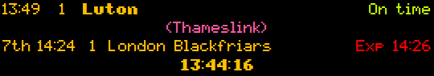

# National Rail Departure Board
> A simple visual departure board coded in Python with Tkinter


___

This is a relatively minimal Tkinter-only graphical National Rail (Great Britain / UK) departure board, created as a replication exercise of a commercially available LED equivalent.


## Requirements

This small project was written using **Python 3.9**, and utilises [Zeep, a SOAP client](https://docs.python-zeep.org/en/master/).

As this is a desktop GUI (using Python's [Tk interface](https://docs.python.org/3/library/tkinter.html)), it can be run on Windows or most Unix-based or -like platforms like macOS only.

You will also need to [register](http://realtime.nationalrail.co.uk/OpenLDBWSRegistration/) for the public LDB Webservice [(OpenLDBWS)](https://lite.realtime.nationalrail.co.uk/openldbws/) to be able to access [National Rail's Darwin](https://www.nationalrail.co.uk/100296.aspx) data feeds.


## Usage

1. **Clone / Download this repository** (the big green "Code" button up above).

2. Ensure you have Python 3.6+ available on your system.

3. From the repo directory, **install Zeep** (and any other requirements):

```bash
$ pip install -r requirements.txt
```

4. **Install the required fonts** in `./fonts/`. These are slightly edited versions of [PixelMix by Andrew Tyler](https://www.dafont.com/pixelmix.font).

5. **[Register](http://realtime.nationalrail.co.uk/OpenLDBWSRegistration/)** for a free **key** (sometimes called a token) to gain access to National Rail data. It should be 32 numbers long with four dashes.

6. **Edit** `config.json` and insert the obtained key/token into the blank `"apiKey"` field, making sure it is surrounded by quotes.

7. Still in `config.json`, edit the three-letter station code in the `"StationCode"` field to correspond to the station you wish to see departures from. A full list is [available here](https://www.nationalrail.co.uk/stations_destinations/48541.aspx), (e.g., `BHM` = Birmingham New Street, `TCR` = Tottenham Court Road, `MAN` = Manchester Piccadilly, etc.)

8. **Run the board** from the directory with:

```bash
$ python departureboard.py
```

9. (To Fix) To close the board, kill it with `ctrl+C`.


## Notes

This remains a fairly naïve implementation of a number of things, and bugs are very likely. Do let me know any!

The GUI itself is a borderless window which can be dragged by the mouse. In lieu of an alternative close button, kill the script in the terminal with `ctrl+C`. These settings can be turned off in `config.json` by setting the relavent fields to `false`.

Only boardable passenger services that call and depart from the specified station are displayed.


## Examples





## To-Do

 - Close window button
 - Other peripheral train information, e.g. coach information, potentially non-passenger services, arrivals.
 - More colour-related features
 - More customisability in settings (i.e. ticker/fade speed, etc.)
 - Different sizes, with more info on.